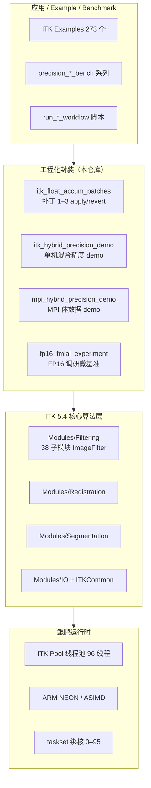
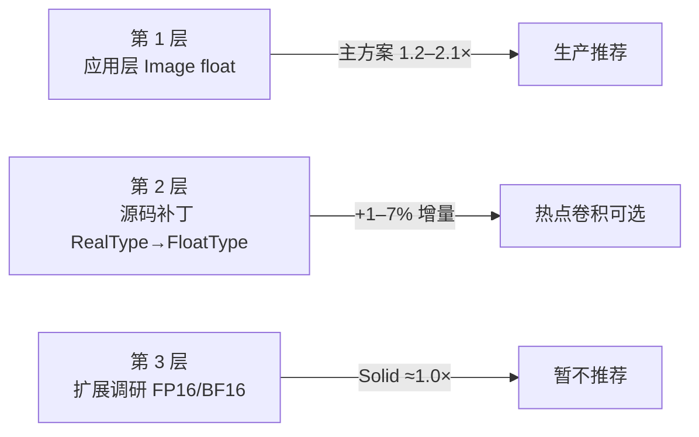

# ITK 5.4 医学影像算法库 — 总体架构与优化技术概述

| 项目名称 | ITK 5.4 华为鲲鹏（ARM64）移植与混合精度优化 |
|----------|---------------------------------------------|
| 文档类型 | 算法库架构说明 + 优化技术概述 |
| 版本 | 2026-07 |
| 适用平台 | 华为鲲鹏 920（aarch64，96 逻辑核） |
| ITK 版本 | Insight Toolkit 5.4.0 |
| 构建目录 | `/home/pub/yyq/ITK-5.4.0/build-yyq` |
| 本地工作区 | `D:\ECNU_HPC\ITK_huawei` |

---

## 文档说明

本文档面向项目汇报与结项材料，分两部分：

| 部分 | 篇幅 | 内容 |
|------|------|------|
| **第一部分** | 约 1 页 | 当前算法库代码总体架构与特点 |
| **第二部分** | 约 3–4 页 | 优化技术概述（平台适配 + 混合精度策略与实现 + 扩展调研） |

详细实测数据与操作步骤见同目录结项报告及各 `操作记录_*.md`。

---

# 第一部分 算法库总体架构（约 1 页）

## 1.1 定位与组成

本项目交付的「算法库」以 **ITK（Insight Toolkit）5.4** 为核心：国际主流开源 **C++ 医学影像处理库**，面向 MRI/CT 等体数据的 **滤波、分割、配准、形态学、扩散** 等任务。在华为鲲鹏平台上完成 **全模块移植** 与 **混合精度优化** 后，形成可在 HPC 环境直接调用的 CPU 算法库。

算法库由三层组成：

| 层次 | 内容 | 路径/规模 |
|------|------|-----------|
| **核心算法层** | ITK 5.4 源码及 CMake 构建产物 | `ITK-5.4.0/Modules/`；Filtering **38** 子模块；Registration **5**；Segmentation **12** |
| **工程化封装层** | 补丁脚本、基准程序、工作流脚本 | 本仓库 `2026-0507/`、`itk_float_accum_patches/`、`itk_hybrid_precision_demo/` |
| **验证与文档层** | 操作记录、结项报告、绑核/扫频脚本 | `2026-0507/操作记录_*.md`；`docs/` |

远端已生成 **273 个** ITK Example 可执行文件（`build-yyq/bin/`），覆盖各模块典型用法。

## 1.2 分层架构



**数据流（典型 pipeline）：**

```
磁盘 IO（PNG/MHA）
    → ImageFileReader
    → ImageFilter 链（Smoothing / Feature / Threshold …）
    → [可选] Registration（Metricsv4 + Optimizer）
    → ImageFileWriter
```

像素类型在应用层选定：`Image<float, Dim>` 用于滤波/分割；配准场景下 **图像 float、变换与度量 double**。

## 1.3 ITK 模块组织

ITK 采用 **CMake 模块化** 设计：每个模块独立编译为库，通过 `find_package(ITK)` 链接。

| 模块组 | 职责 | 本项目状态 |
|--------|------|------------|
| **Filtering** | 平滑、卷积、阈值、扩散、形态学等 **38** 个子目录 | 全部移植 ✅；混合精度已配置 ✅ |
| **Registration** | 配准度量（Metricsv4）、优化器、变换 | 移植 ✅；float 存 + double 算 ✅ |
| **Segmentation** | Level-set、连通域、分水岭等 **12** 子目录 | 移植 ✅；应用层 float ✅ |
| **IO / Common** | 读写、数据结构、多线程、NumericTraits | 随全库构建 ✅ |
| **GPU*** | OpenCL/CUDA 加速 Filter | **未启用**；鲲鹏 CPU 节点以 **CPU 等价 Filter** 交付 |

Filtering 内每个子模块提供若干 `*ImageFilter` 类，继承自 `ImageToImageFilter` 或 `FiniteDifferenceImageFilter`，通过 **模板参数 `TPixel`** 支持 `float` / `double` / 整数像素类型。

## 1.4 本仓库工程化结构

本地工作区 `ITK_huawei` 在 ITK 上游之上增加 **可复现的移植与优化资产**：

```
ITK_huawei/
├── 2026-0507/
│   ├── itk_float_accum_patches/      # 三批 RealType→FloatType 补丁
│   ├── itk_hybrid_precision_demo/    # precision_*_bench 基准套件
│   ├── mpi_hybrid_precision_demo/   # MPI 混合精度示例
│   ├── fp16_fmlal_experiment/        # FP16 存储调研（+fp16）
│   └── 操作记录_*.md / 结项报告 *.md
├── docs/                             # 文档与脚本索引
├── bench_itk_*.sh                    # 绑核、扫频、加速比脚本
└── run_*_workflow.sh / .cmd          # 一键补丁+编译+benchmark
```

**设计原则：** ITK 源码树与补丁分离——补丁通过 `apply_*.sh` / `revert_*.sh` 可逆应用，便于对比 float 累加前后性能，且不破坏上游目录结构的可维护性。

## 1.5 架构特点小结

| 特点 | 说明 |
|------|------|
| **模块化** | 按 ITK CMake 模块组织，Filtering/Registration/Segmentation 独立交付与验证 |
| **模板化精度** | 像素类型编译期绑定；混合精度靠 **应用层选型 + 选择性源码补丁**，非全局自动框架 |
| **CPU 优先** | 鲲鹏 NEON + Pool 多线程；GPU 模块以 CPU 同名算子覆盖 |
| **可验证** | 每层均有 benchmark / Example / 操作记录，加速比与 max_abs 可复现 |
| **可扩展** | 补丁脚本 + 微基准框架可接入新 Filter 或新精度路径（如 BF16 基础设施） |

---

# 第二部分 优化技术概述（约 3–4 页）

## 2.1 鲲鹏平台适配优化

### 2.1.1 编译与 SIMD 向量化

ITK 在鲲鹏上采用 **GCC 10.1.0 + Release + `-O3`** 编译。SIMD 方面启用 **ARMv8.2-A + crypto**（含 **NEON/ASIMD**）：

| 项目 | 策略 |
|------|------|
| 推荐 march | **`-march=armv8.2-a+crypto`** |
| 避免 | **`-march=native`**（系统脚本可能展开 `dotprod+fp16fml`，与 **as 2.27** 不兼容导致汇编失败） |
| 验证 | `objdump` 可见热点循环生成 **`fmla v*.4s`**（float）或 **`fmla v*.2d`**（double） |

**要点：** 编译选项决定 ITK Filter 内层循环是否生成 NEON 浮点乘加；这是后续混合精度能否转化为 **算力加速** 的前提。

### 2.1.2 移植过程关键工程问题

| 问题 | 解决方案 |
|------|----------|
| 目录迁移导致 CMake 缓存失效 | 新建 `build-yyq` 全量重配重编 |
| `kunpeng-simd.sh` 注入 `-march=native` | 洁净环境编译，显式固定 march |
| GPU 模块无硬件 | 不启用 ITKGPU*；CPU 等价 Filter 已移植 |
| 双机 MPI | OpenMPI smoke + `mpi_hybrid_precision_demo` 验证通过 |

---

## 2.2 多线程与绑核优化

### 2.2.1 ITK 并行模型

ITK 5.4 默认使用 **Pool 线程池（pthread）**，**不是** OpenMP threader。因此：

- 线程数：`ITK_GLOBAL_DEFAULT_NUMBER_OF_THREADS=96`
- 线程后端：`ITK_GLOBAL_DEFAULT_THREADER=Pool`
- **`OMP_NUM_THREADS` 不能单独控制 ITK Filter 并行度**

### 2.2.2 CPU 绑核

对整进程使用 **`taskset -c 0-95`**，与 96 逻辑核一一对应，避免 OS 迁移带来的 cache 失效与计时抖动。绑核验证见 `verify_bind_htop.sh`、`thread_affinity_probe.cpp`。

### 2.2.3 算子相关的线程策略（扫频结论）

| 算子类型 | 线程特征 | 建议 |
|----------|----------|------|
| 大图 Bilateral / 卷积 | 96 线程相对 16 线程仍有明显加速 | 可用满核 |
| 小图 Example（如 256²） | 有效并行约十几路，16≈96 | 不必强追满核 |
| 迭代扩散 CAD/GAD | 强依赖同步，96 核可能不如 16 核 | 按算子扫频选线程数 |

**结论：** 并行优化不能「一刀切满核」，需结合 **算子特性 + 图像尺寸** 配置线程数。

---

## 2.3 混合精度：问题背景与 ITK 机制

### 2.3.1 为何需要混合精度

医学影像 pipeline 中，**double 像素** 常带来 **2× 内存占用** 与 **更低 cache 命中率**；而 CT/MRI 体数据在滤波、分割阶段对 **float 精度通常足够**。配准、优化等步骤则仍需 **double** 保证收敛与数值稳定。

ITK **没有** PyTorch/CUDA 式「全局自动 FP16/BF16 + loss scaling」框架，混合精度在本项目中指：

1. **按阶段选择像素类型**（`Image<float>` vs `Image<double>`）  
2. **Filter 内部累加类型**（`NumericTraits::RealType` 多为 double，即 float 像素仍可能 double 累加）  
3. **配准专用模式**：float 图像存储 + double 度量/变换/优化器  

### 2.3.2 ITK 精度相关基础设施

| 机制 | 作用 | 对性能的影响 |
|------|------|--------------|
| `Image<TPixel, Dim>` 模板 | 决定 **存储精度** | float 存储 → 内存减半，带宽敏感算子受益 |
| `NumericTraits::FloatType` / `RealType` | 决定 Filter **内部计算精度** | RealType=double 时，float 像素仍走 double 指令 |
| `SpacePrecisionType` | 仅 origin/spacing/direction | **几乎不影响** 像素计算性能 |
| `CastImageFilter` | pipeline 中切换精度 | 频繁 cast 有开销，不当使用会 **变慢** |

**核心发现（2026-06 审计）：** 仅改 `Image<float>` **不能保证** 内部用 float 计算——须审计 `RealType` 或打补丁。

---

## 2.4 混合精度策略实现（三层路径）

本项目采用 **由易到难、实测驱动** 的三层策略：



### 2.4.1 第 1 层：应用层 float 化（主方案，不改 ITK 源码）

**做法：**

```cpp
using ImageType = itk::Image<float, 3>;
// 滤波 / 分割 pipeline 全程 Image<float>
// 配准：float 固定/移动图像 + Metricsv4（内部 double 度量）
```

**配准推荐模式：**

```
Image<float> 读入
    → MeanSquaresImageToImageMetricv4（度量/梯度 double）
    → Optimizer / Transform parameters（double）
```

**已放弃模式：** `float → Cast→double → Filter → Cast→float` 的 **hybrid cast 链**——实测常 **慢于 full_double**（cast 开销大于计算节省）。

**实测收益（96 线程，Brain MRI）：**

| 算子 / 场景 | 加速比（vs full_double） | max_abs |
|-------------|-------------------------|---------|
| SmoothingRecursiveGaussian | **2.04–2.07×** | 0 |
| Otsu / Median 链 | **1.29–1.36×** | 0 |
| Metricsv4 配准 | **1.36×** | Δ平移 <0.003 mm |
| DiscreteGaussian | **1.07×**（1024²） | ~1e-5 |

**适用：** 全部 Filtering 模块的默认交付方式；Registration 生产路径。

### 2.4.2 第 2 层：源码补丁 — Filter 内部 float 累加

针对 **`NumericTraits<float>::RealType = double`** 导致「float 像素、double 算力」的热点 Filter，维护 **三批可逆补丁**（`itk_float_accum_patches/`）：

| 批次 | 修改文件 / 对象 | 受益模块 | 实测增量 |
|------|-----------------|----------|----------|
| **补丁 1** | Bilateral、Mean、DiscreteGaussian 头文件 | ImageFeature、Smoothing | 卷积类 **+1–7%**（1024²） |
| **补丁 2** | Bilateral 域核、值域查表、内层循环 | ImageFeature | 相对补丁 1 再 **~1%**（exp 不在内层） |
| **补丁 3** | `FiniteDifferenceFunction::PixelRealType`、`BoxUtilities::AccPixType` | AnisotropicSmoothing、BoxMean | CAD **1.04×**；BoxMean **1.02×** |

**补丁示例（概念）：**

```cpp
// 补丁前
using OutputPixelRealType = NumericTraits<T>::RealType;   // float 像素 → double 累加

// 补丁后
using OutputPixelRealType = NumericTraits<T>::FloatType;   // float 像素 → float 累加 → NEON fmla.4s
```

**工作流：** `apply_patches.sh` → 重编 `ITKImageFeature` / `ITKSmoothing` / `ITKAnisotropicSmoothing` → `precision_conv_bench` / `precision_diffusion_bench` 验证。

**结论：** 补丁解决 **算力路径**（double→float 指令）；对大图 Bilateral 等 **内存带宽主导** 算子，增量有限（~1%），但 **max_abs 可保持 0**。

### 2.4.3 第 3 层：FP16 / FMLAL / BF16 扩展调研（未纳入生产）

| 方向 | 内容 | 结论 |
|------|------|------|
| **+fp16 存储 + 拓宽** | FP16 缓冲，`static_cast`/fcvt 到 FP32 后计算 | Solid 全模块平均 **≈1.00×**；**不能替代** 第 1 层 |
| **FMLAL（+fp16fml）** | FP16 乘、FP32 累加硬件指令 | 本节点 **as 2.27 无法汇编**；未产出性能数据 |
| **BF16 像素类型** | ITK fork 级 NumericTraits 改造 | 列为远期；CPU 上需 AVX512-BF16 / ARM BF16 方有算力收益 |

**FP16 Solid 复测要点（1024²，30 对交错 + 截尾中位数）：**

| 内核 | speedup | 判定 |
|------|---------|------|
| box_mean_r15 | 1.00× | 无收益 |
| separable_gaussian_r15 | 1.16× | 微内核有收益，**待 ITK 端到端验证** |
| pointwise / Metricsv4 | 0.92–0.93× | **更慢** |

**生产建议：** 继续 **`Image<float>` + 配准 double**；**不部署 FP16 存储**；FMLAL 待工具链升级后再评估。

---

## 2.5 混合精度与模块交付的对应关系

全部 **38 个 Filtering 模块** 均完成混合精度配置，方式如下：

| 方式 | 模块范围 | 加速比来源 |
|------|----------|------------|
| **应用层 float** | 绝大多数模块 | 直接 benchmark 或 **代表算子法**（同条件 A 下已测算子外推，标注「代表值」） |
| **补丁 1–3** | Bilateral、Mean、DiscreteGaussian、CAD/GAD、BoxMean | 直接实测（条件 B/C） |
| **ITK 原生 float 内部** | SmoothingRecursiveGaussian | 直接实测 **~2×** |
| **配准 double 度量** | Metricsv4、RegistrationMethodsv4 | `precision_registration_bench` |

**代表算子法：** 对未单独编写 benchmark 的模块，采用同类型热点算子的加速比（如邻域类→Median **1.36×**，卷积类→Gaussian **1.24×**），并在结项表中标注「代表值」。

---

## 2.6 性能验证体系

本项目建立 **分层 benchmark** 与 **可复现工作流**，支撑架构与优化结论：

| 程序 / 脚本 | 验证内容 |
|-------------|----------|
| `precision_pipeline_bench` | 滤波/分割链 full_float vs full_double（条件 A） |
| `precision_conv_bench` | Bilateral、Mean、DiscreteGaussian、BoxMean、FFT（条件 B） |
| `precision_registration_bench` | Metricsv4 float 存 + double 度量 |
| `precision_diffusion_bench` | CAD/GAD 扩散（条件 C） |
| `bench_itk_larger_examples_sweep.sh` | 多 Example + 1024²–16384² 扫频 |
| `fp16_solid_bench` | FP16 存储 Solid 复测（去噪） |
| `run_float_accum_workflow.sh` 等 | 补丁 → 重编 → benchmark 一键流程 |

**统一指标：**

- **加速比：** `ms_double / ms_float`（>1 表示 float 更快）  
- **精度：** `max_abs`、`rmse`、配准平移误差（mm）  
- **环境：** 96 线程 + `taskset -c 0-95` + BrainProtonDensity 官方数据  

---

## 2.7 优化技术总结

| 优化技术 | 实现方式 | 典型收益 | 生产建议 |
|----------|----------|----------|----------|
| **鲲鹏 NEON 编译** | `-march=armv8.2-a+crypto -O3` | 启用 SIMD 乘加 | **必须** |
| **Pool 多线程 + 绑核** | ITK Pool + taskset | 大图算子近线性扩展 | **推荐**；迭代类需扫频 |
| **应用层 Image float** | 不改源码 | **1.2–2.1×** | **默认主方案** |
| **配准 float 存 + double 算** | Metricsv4 官方模式 | **1.36×**，收敛可靠 | **配准必用** |
| **源码补丁 float 累加** | 三批 apply/revert | 卷积 **+1–7%** | 热点可选 |
| **hybrid cast 链** | CastImageFilter 链 | **更慢** | **已废弃** |
| **FP16 存储 + 拓宽** | +fp16 微基准 | **≈1.0×** | **不推荐** |
| **FMLAL / BF16** | 未部署 | 未验证 / 远期 | **后续研究** |

---

## 2.8 推荐 pipeline 模板（生产）

```
[IO] 读入 → Image<float, 3>
[滤波] RecursiveGaussian / DiscreteGaussian / Median …（full_float）
[分割] Otsu / Level-set …（full_float，迭代类单独验收精度）
[配准] 可选：float 图像 + Metricsv4 + double Transform
[IO] 写出
```

**关键原则：**

1. 滤波/分割 **直接用 float**，不要 cast 链。  
2. 配准 **float 存、double 算**。  
3. 热点卷积可选 **补丁 1–3**，预期 **个位数百分比** 增量。  
4. 线程数按算子扫频配置；扩散类慎用满核。  
5. FP16/BF16 **不替代** 上述方案。

---

## 附录：相关文档索引

| 文档 | 用途 |
|------|------|
| [`ITK鲲鹏移植与混合精度优化_完整结项报告.md`](./ITK鲲鹏移植与混合精度优化_完整结项报告.md) | 结项主报告 |
| [`混合精度.md`](./混合精度.md) | 混合精度方案与三层路径 |
| [`混合精度优化完成情况汇报.md`](./混合精度优化完成情况汇报.md) | 模块完成情况 + 补丁附录 |
| [`操作记录_FP16全模块存储拓宽实验_2026-07-02.md`](./操作记录_FP16全模块存储拓宽实验_2026-07-02.md) | FP16 Solid 复测 |
| [`itk_float_accum_patches/README.md`](./itk_float_accum_patches/README.md) | 补丁使用说明 |

---

*文档依据 2026 年 5–7 月鲲鹏平台实测与仓库当前实现整理。*
